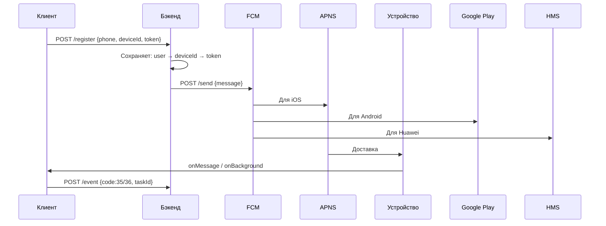

# Работа с Push-уведомлениями: Полный обобщённый документ для лекции
**Цель**: Подробное руководство для преподавателей и разработчиков — от теории до практики.  
**Формат**: Лекционный материал с объяснениями, примерами, схемами, ограничениями и лучшими практиками.

---

## Содержание
1. [Введение в Push-уведомления](#1)
2. [Архитектура системы доставки](#2)
3. [Payload: Структура и обязательные поля](#3)
4. [Цели доставки (Target)](#4)
5. [Видимое уведомление (`notification`)](#5)
6. [Кастомные данные (`data`)](#6)
7. [Платформенные настройки: Android (`android`)](#7)
8. [Платформенные настройки: iOS (`apns`)](#8)
9. [Silent Push и фоновые обновления](#9)
10. [Ограничения и лимиты](#10)
11. [Схема взаимодействия: Клиент ↔ Бэкенд ↔ FCM/APNS/HMS](#11)
12. [Регистрация токена и управление сессиями](#12)
13. [Обработка уведомлений в разных состояниях приложения](#13)
14. [Отклик на бэкенд (eventCode 35/36)](#14)
15. [Поддержка Huawei: Flavor-based подход](#15)
16. [Настройка проектов (Firebase + Huawei)](#16)
17. [Flutter: Реализация и зависимости](#17)
18. [Лучшие практики и отладка](#18)
19. [Заключение](#19)

---

<a name="1"></a>
## 1. Введение в Push-уведомления

**Push-уведомление** — это сообщение, отправляемое **с сервера на устройство**, даже если приложение:
- Закрыто (terminated),
- В фоне (background),
- Или открыто (foreground).

### Зачем нужны?
| Сценарий | Пример |
|--------|-------|
| Информирование | «Ваша посылка доставлена» |
| Персональные акции | «Скидка 30% на ваш любимый кофе» |
| Фоновая синхронизация | Обновление данных без открытия приложения |
| Навигация | Переход на экран акции по клику |

---

<a name="2"></a>
## 2. Архитектура системы доставки

```
[Backend] 
   ↓ (HTTP POST)
[FCM / HMS API] 
   ├──→ Google Play Services → Android (Google)
   ├──→ APNS → iOS
   └──→ HMS Core → Android (Huawei)
   ↓
[Мобильное приложение]
```

### Роли компонентов:
| Компонент | Функция |
|---------|--------|
| **FCM** | Единый интерфейс для Android + iOS |
| **APNS** | Только iOS, строгие требования к формату |
| **HMS Push Kit** | Для Huawei без Google-сервисов |
| **Backend** | Хранит токены, фильтрует получателей |
| **Клиент** | Регистрирует токен, обрабатывает уведомления |

> FCM **не доставляет напрямую** — он **проксирует**:
> - Android → Google Play Services
> - iOS → APNS

---

<a name="3"></a>
## 3. Payload: Структура и обязательные поля

**Payload** — это **JSON-объект**, который определяет:
- **Кому** отправить,
- **Что** показать,
- **Как** обработать.

### FCM: Полная структура
```json
{
  "message": {
    "token": "fcm_token_abc123",        // ← Обязательно одно из трёх
    // "topic": "offers",
    // "condition": "'ru' in topics && 'promo' in topics",

    "notification": {                   // Видимая часть
      "title": "Акция дня!",
      "body": "Скидка 50% на всё до 18:00",
      "image": "https://cdn.example.com/promo.jpg"
    },

    "data": {                           // Кастомные данные
      "offer_id": "789",
      "deeplink": "/offer/789",
      "type": "sale"
    },

    "android": { /* Android */ },
    "apns": { /* iOS */ }
  }
}
```

> **Обязательно**: **одно** из `token`, `topic`, `condition`  
> **Опционально**: всё остальное

---

<a name="4"></a>
## 4. Цели доставки (Target)

| Поле | Описание | Пример |
|------|--------|--------|
| `token` | **ОДНО** устройство | `"fcm_abc123..."` |
| `topic` | Группа (подписка) | `"news"`, `"user_123"` |
| `condition` | Логическое выражение | `"'sports' in topics && 'moscow' in topics"` |

### Примеры `condition`:
```js
// Пользователи из RU и с подпиской на акции
"'ru' in topics && 'promo' in topics"

// Новые пользователи ИЛИ VIP
"'new' in topics || 'vip' in topics"

// НЕ из теста
"!('test' in topics)"
```

> **Только одно** поле в одном сообщении!

---

<a name="5"></a>
## 5. Видимое уведомление (`notification`)

```json
"notification": {
  "title": "Внимание!",
  "body": "Ваша заявка одобрена",
  "image": "https://example.com/approved.jpg"
}
```

### Особенности:
- **Отображается системой** (не приложением).
- **Не требует** открытия приложения.
- **Изображения**:
    - Поддержка: JPEG, PNG, BMP
    - Android: ≤ 1 МБ
    - iOS: отображается в развёрнутом виде

> Используйте для **важных событий**, требующих внимания.

---

<a name="6"></a>
## 6. Кастомные данные (`data`)

```json
"data": {
  "taskId": "456",
  "screen": "offer_details",
  "offer_url": "https://app.example.com/offer/456"
}
```

### Правила:
| Правило | Пояснение |
|-------|----------|
| Только **плоский** объект | `{ key: string }` |
| Нельзя вложенность | `{ "user": { "id": 1 } }` → ошибка |
| Решение: **строковое представление** | `"user": "{\"id\":1,\"name\":\"Ivan\"}"` |
| Запрещённые ключи | `from`, `message_type`, `google.*`, `gcm.notification.*` |

### Когда использовать?
- Навигация по клику
- Фоновая обработка
- Идентификаторы задач

---

<a name="7"></a>
## 7. Платформенные настройки: Android (`android`)

```json
"android": {
  "ttl": "3600s",
  "priority": "HIGH",
  "collapse_key": "daily_promo",

  "notification": {
    "title": "Акция!",
    "body": "Только сегодня!",
    "icon": "ic_promo",
    "color": "#FF0000",
    "sound": "promo_sound.mp3",
    "tag": "promo_2025",
    "click_action": "FLUTTER_NOTIFICATION_CLICK",
    "channel_id": "promotions",
    "sticky": false,
    "notification_priority": "PRIORITY_HIGH",
    "image": "https://cdn.example.com/big.jpg"
  }
}
```

### Ключевые поля:

| Поле | Описание |
|------|--------|
| `priority` | `HIGH` — сразу, `NORMAL` — с задержкой (экономия батареи) |
| `ttl` | Время жизни оффлайн-сообщения (макс. 4 недели) |
| `collapse_key` | Группировка: новые заменяют старые |
| `tag` | **Замена** уведомления с тем же тегом |
| `channel_id` | **Обязателен** на Android 8+ |
| `click_action` | Intent при клике (для Flutter) |
| `sticky` | `true` — не исчезает при клике |

> **Важно**: Приложение **должно создать канал** до получения уведомления!

---

<a name="8"></a>
## 8. Платформенные настройки: iOS (`apns`)

```json
"apns": {
  "headers": {
    "apns-priority": "10",
    "apns-push-type": "alert",
    "apns-topic": "com.example.app"
  },
  "payload": {
    "aps": {
      "alert": {
        "title": "Новое предложение",
        "subtitle": "Только для вас",
        "body": "Нажмите, чтобы узнать подробности"
      },
      "badge": 3,
      "sound": "default",
      "category": "OFFER_CATEGORY"
    },
    "offer_id": "123"
  }
}
```

### Заголовки (`headers`):
| Заголовок | Значение |
|---------|--------|
| `apns-priority` | `10` — высокая, `5` — обычная (для silent) |
| `apns-push-type` | `alert`, `background` |
| `apns-expiration` | Unix timestamp (по умолчанию +30 дней) |

> `apns-topic` = **Bundle ID** приложения

---

<a name="9"></a>
## 9. Silent Push и фоновые обновления

**Silent Push** — уведомление **без видимой части**, только для фоновой обработки.

### Пример:
```json
{
  "message": {
    "token": "ios_token",
    "apns": {
      "headers": {
        "apns-priority": "5",
        "apns-push-type": "background"
      },
      "payload": {
        "aps": {
          "content-available": 1
        },
        "task": "refresh_balance",
        "user_id": "123"
      }
    }
  }
}
```

### Особенности:
- **Не показывает** уведомление
- **Разбуживает** приложение на **~30 секунд**
- Используется для:
    - Обновления данных
    - Синхронизации
    - Подготовки контента

> На Android: используйте `data`-сообщение с `priority: "HIGH"`

---

<a name="10"></a>
## 10. Ограничения и лимиты

| Параметр | Лимит |
|--------|------|
| **Размер payload** | **4096 байт** (включая ключи и пробелы) |
| **Data** | Только `{ string: string }` |
| **Частота отправки** | ~500 сообщений/сек на проект |
| **Токенов в topic** | До 1 млн |
| **Изображения** | Android ≤ 1 МБ, iOS — по сети |
| **APNS приоритет** | `5` для data-only, `10` для alert |

> **Совет**: Сжимайте JSON, избегайте лишних полей.

---

<a name="11"></a>
## 11. Схема взаимодействия: Клиент ↔ Бэкенд ↔ FCM/APNS/HMS



---

<a name="12"></a>
## 12. Регистрация токена и управление сессиями

### Когда регистрировать токен?
1. После **авторизации**
2. При **запуске приложения**
3. При **смене аккаунта**

### Алгоритм:
```dart
// 1. Удалить старый
await FirebaseMessaging.instance.deleteToken();

// 2. Получить новый
String? token = await FirebaseMessaging.instance.getToken();

// 3. Отправить на бэкенд
await api.registerDevice(
  phone: "+79123456789",
  deviceId: "uuid-abc123",
  token: token,
  deviceType: "android" // или "ios"
);
```

### Бэкенд хранит:
```json
{
  "user_id": "123",
  "device_id": "abc123",
  "fcm_token": "fcm_...",
  "last_active": "2025-10-31T12:00:00Z"
}
```

> Гарантирует доставку **только текущему устройству**

---

<a name="13"></a>
## 13. Обработка уведомлений в разных состояниях

| Состояние | Android | iOS |
|---------|--------|-----|
| **Foreground** | `onMessage` | `onMessage` |
| **Background** | `onBackgroundMessage` | Notification Service Extension |
| **Terminated** | `getInitialMessage()` | `getInitialMessage()` |

### Пример (Flutter):
```dart
FirebaseMessaging.onMessage.listen((message) {
  // Показать локальное уведомление
  flutterLocalNotifications.show(...);
  // Отправить отклик
  sendEvent35(message.data['taskId']);
});

FirebaseMessaging.onBackgroundMessage(_backgroundHandler);

Future<void> _backgroundHandler(RemoteMessage message) async {
  sendEvent35(message.data['taskId']);
}
```

---

<a name="14"></a>
## 14. Отклик на бэкенд (eventCode 35/36)

| Код | Событие |
|-----|--------|
| **35** | Уведомление **показано** |
| **36** | Пользователь **кликнул** |

### Пример отклика:
```http
POST /api/events
{
  "eventCode": 36,
  "taskId": "12345",
  "deviceId": "abc123"
}
Authorization: Bearer access_token
```

> Используется для аналитики и подтверждения доставки

---

<a name="15"></a>
## 15. Поддержка Huawei: Flavor-based подход

### Почему flavor?
- Разные зависимости
- Разные токены
- Разные API

### `build.gradle`:
```gradle
flavorDimensions "vendor"
productFlavors {
  google { dimension "vendor" }
  huawei { dimension "vendor" }
}

dependencies {
  googleImplementation 'com.google.firebase:firebase-messaging:23.0.0'
  huaweiImplementation 'com.huawei.hms:push:6.3.0.300'
}
```

### `pubspec.yaml`:
```yaml
dependencies:
  firebase_messaging: ^14.0.0
  huawei_push: ^6.3.0
  device_info_plus: ^9.0.0
```

### DI:
```dart
bind<MessagesDataSource>().toProvide(() {
  return flavor == 'huawei'
    ? HMSMessagesDataSource()
    : FirebaseMessagesDataSource();
});
```

---

<a name="16"></a>
## 16. Настройка проектов

### Firebase
1. [console.firebase.google.com](https://console.firebase.google.com)
2. Добавить Android → `google-services.json`
3. Добавить iOS → `GoogleService-Info.plist`
4. Включить **Push Notifications** в Xcode
5. Загрузить `.p8` ключ (APNS Auth Key)

### Huawei
1. [developer.huawei.com](https://developer.huawei.com)
2. Создать приложение → `agconnect-services.json`
3. Добавить в `android/app/`
4. Включить Push Kit

---

<a name="17"></a>
## 17. Flutter: Реализация

### Инициализация:
```dart
void main() async {
  WidgetsFlutterBinding.ensureInitialized();

  if (flavor == 'google') {
    await Firebase.initializeApp(
      options: DefaultFirebaseOptions.currentPlatform,
    );
  }

  runApp(MyApp());
}
```

### Обработка:
```dart
class NotificationsWrapper extends StatelessWidget {
  @override
  Widget build(BuildContext context) {
    return BlocProvider(
      create: (_) => NotificationsBloc()..add(InitNotificationsEvent()),
      child: child,
    );
  }
}
```

---

<a name="18"></a>
## 18. Лучшие практики и отладка

### Практики:
1. **Используйте `tag`** — избегайте дублирования
2. **Ограничивайте `ttl`** — не храните устаревшее
3. **Тестируйте silent push** — проверьте `content-available`
4. **Локализация**:
   ```json
   "title_loc_key": "PROMO_TITLE",
   "title_loc_args": ["50%"]
   ```
5. **Мониторинг**:
    - Firebase Console → Messaging
    - HMS Console → Push Kit

### Отладка:
- **Логи FCM**: `adb logcat | grep FCM`
- **APNS**: Xcode Console
- **Тестовые токены**: Используйте тестовое устройство

---

<a name="19"></a>
## 19. Заключение

Push-уведомления — **ключевой канал взаимодействия** с пользователем.  
Правильная реализация включает:
- Корректную структуру payload
- Учёт платформенных особенностей
- Надёжную обработку во всех состояниях
- Поддержку Huawei
- Аналитику доставки

---

**Источники**:
- [FCM REST API](https://firebase.google.com/docs/reference/fcm/rest/v1/projects.messages)
- [APNS Docs](https://developer.apple.com/documentation/usernotifications)
- [Huawei Push Kit](https://developer.huawei.com/consumer/en/hms/huawei-pushkit)
